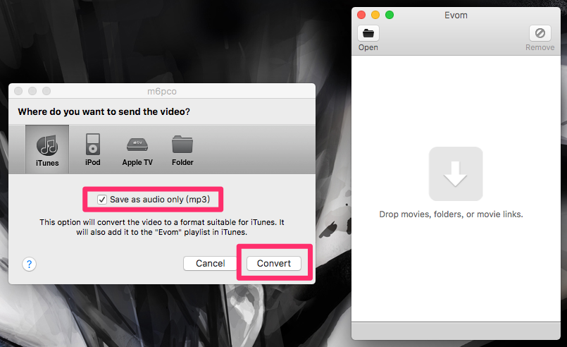
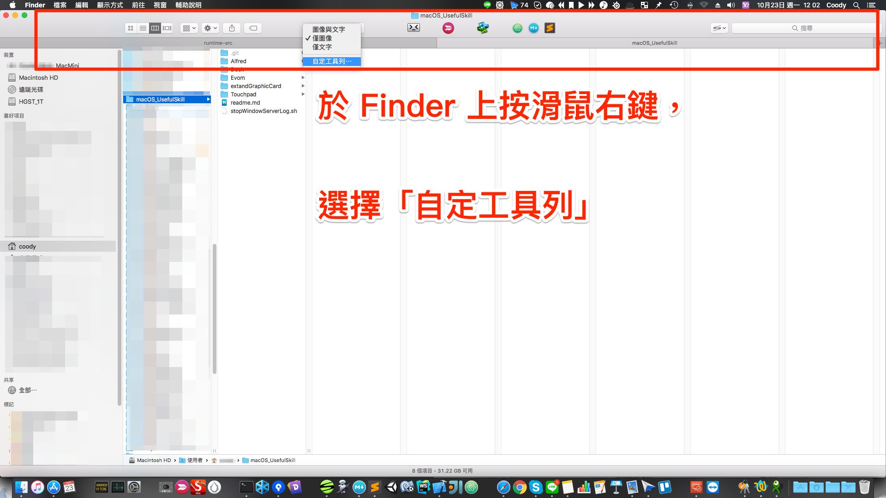
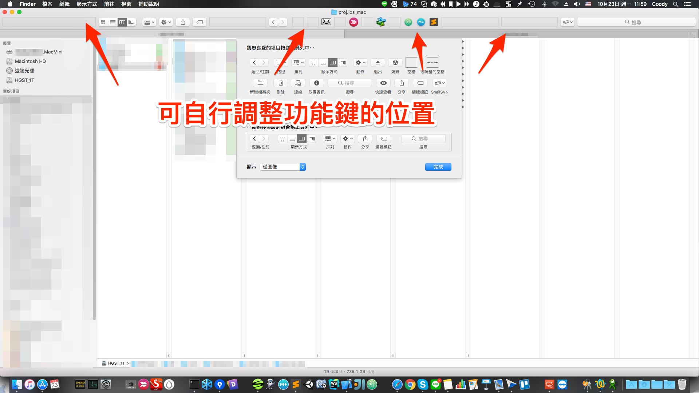
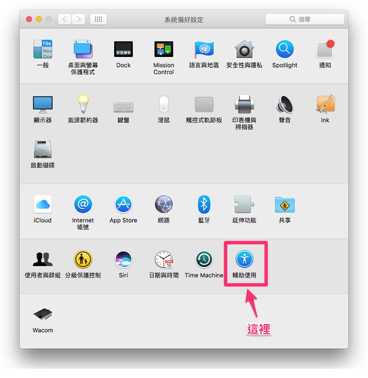
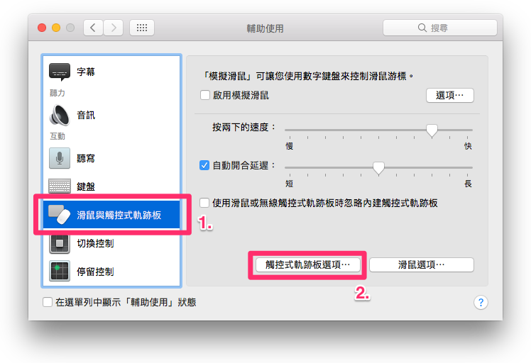
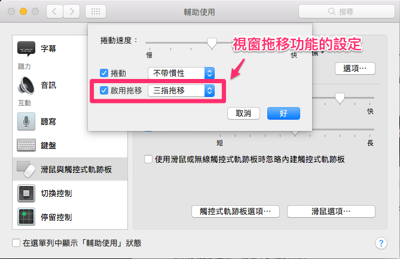
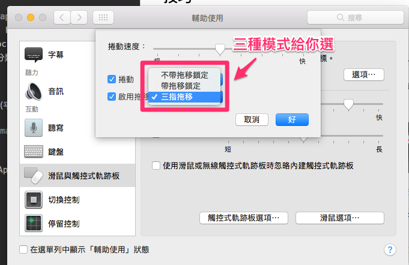

# macOS 好用技巧
很多剛踏入 Mac 的使用者會問我，macOS 為何有點難用，我覺得問題應該出在：你不曉得有哪些技巧讓他變成「適合你的」作業系統，如果你懂這些技巧，你就可以在自己電腦上面工作、生活達到事半功倍的效果，不管是檔案管理、快速切換工作視窗、自動化工作項目、 shell script、然後再來我會介紹一些好用的第三方軟體來提升工作效率。

所以這篇文章主要是我玩了 mac 那麼多年的一點心得跟記錄，希望能幫助到大家。

## 第三方軟體

* [Alfred](https://www.alfredapp.com)：
	* 這軟體絕對能提昇你工作效率至少 100%，不管是快速打開網址、快速查詢各種資料（透過 google , youtube 等等，可以自設快捷鍵的定義），或是查英文單字、算數（連三角函數跟 pi 都可以做運算）。
	* [使用技巧詳細教學](Alfred/)

* [Evom](http://thelittleappfactory.com)，影片直轉 MP3 的免費軟體：
	* 這裡補個小技巧，將此軟體拉到 Finder 上方，每次將影片用拖拉即可轉成 MP3。
	
	
	
	拖拉過去放掉以後，就會出現如下圖：
	
	
	
	就可以轉成 mp3 了。
	* PS：如何將應用程式拖拉到工具列上，很簡單，只要你在拖拉應用程式的時候，按下 command 鍵（不要放）然後拖拉到上方 Bar 就會看到應用程式旁邊多一個 + 號，放掉即可固定在 Finder 上方，然後再自行調整適當位置。

* [Go2Shell](https://itunes.apple.com/tw/app/go2shell/id445770608?l=zh&mt=12):快速在此資料夾打開「終端機」(Terminal)：
	* 如何快速開啟 AppStore 上面的圖片已經說明的很清楚了（使用上面所提的「固定應用程式到 Finder 的方式」即可）


## 技巧

* __常用功能放上 Finder 、變更 Finder 上方的排列方式。__
	* 在 Finder 上方直接滑鼠右鍵點擊

	

	* 出現可以調整的空格、以及基本系統提供的功能
	
	

* __Dock 分類放（使用空格技巧）：__
	* 開啟「終端機」(Terminal)後鍵入 ```defaults write com.apple.dock persistent-apps -array-add '{"tile-type"="spacer-tile";}'``` ，按下 Enter 後，在輸入第二個指令 ```killall Dock``` ，即可發現你多了一個「可以拖拉」的空格在 Dock 上，這個方式可以讓你把同樣性質的 App 集中放，讓你工作時找 Dock 上的 App 更快速！底下是我分類的圖式：
	
	
	
* __微調聲音：__ ```alt + shift + F11 or F12``` ，可以微調聲音（平常的 1/4 ）

* __螢幕截圖：__ ```command + shift + 3``` 整個螢幕截圖；```command + shift + 4``` 選取範圍截圖。

* 有人曾經問過我：再使用觸控板的情況下，拖拉視窗非常的麻煩。放心 Apple 都幫你想好了，這個好用的設定藏在一個很不起眼的地方：




	* 這裡設定有三個選擇：
		1. 不帶拖移鎖定  <-- 表示點擊了視窗可以拖拉處之後，鼠標移動到哪裡，視窗不會跟著動，直到你下次點擊，視窗就會移動到該處。
		2. 帶拖移鎖定   <-- 同上，只是當你鼠標移動的時候，視窗會跟著動而已。
		3. 三指拖移    <-- 當你將鼠標放置在視窗可拖移處，然後用三隻手指滑動時，視窗會跟著滑動。
		
## macOS 10.12.6 使用 eGPU 安裝外接顯卡（顯卡： Radeon RX 560 ）

* [詳細請點我](extandGraphicCard/)


## Automator 自動化機器人用法

待補

## 常用的 ShellScript
* 開啟/關閉所有隱藏檔案： showAllFile.sh
  使用方式
  1. 打開終端機。
  2. 在終端機底下輸入 ```sh showAllFile.sh true``` 即可。


## Issue

* USB displayLink 發生 macOS 瘋狂寫入 log ，造成 CPU 滿載問題，請服用這資料夾下的 ```stopWindowServerLog.sh``` ，點擊兩下，輸入你帳號的密碼（因為是 sudo 命令）即可。

	```
	# 內部指令
	# show WindowServer log pid
	pidString=`ps -A | grep WindowServer`
	echo $pidString
	
	# stop WindowServer warning log
	PID=`pgrep -f WindowServer`
	sudo log config --process=$PID --mode "level:off"
	```
	* 簡易說明一下內部做的事情，就是找出 WindowServer 這個執行的 pid ，然後把這個 pid 的 show log 取消掉。
